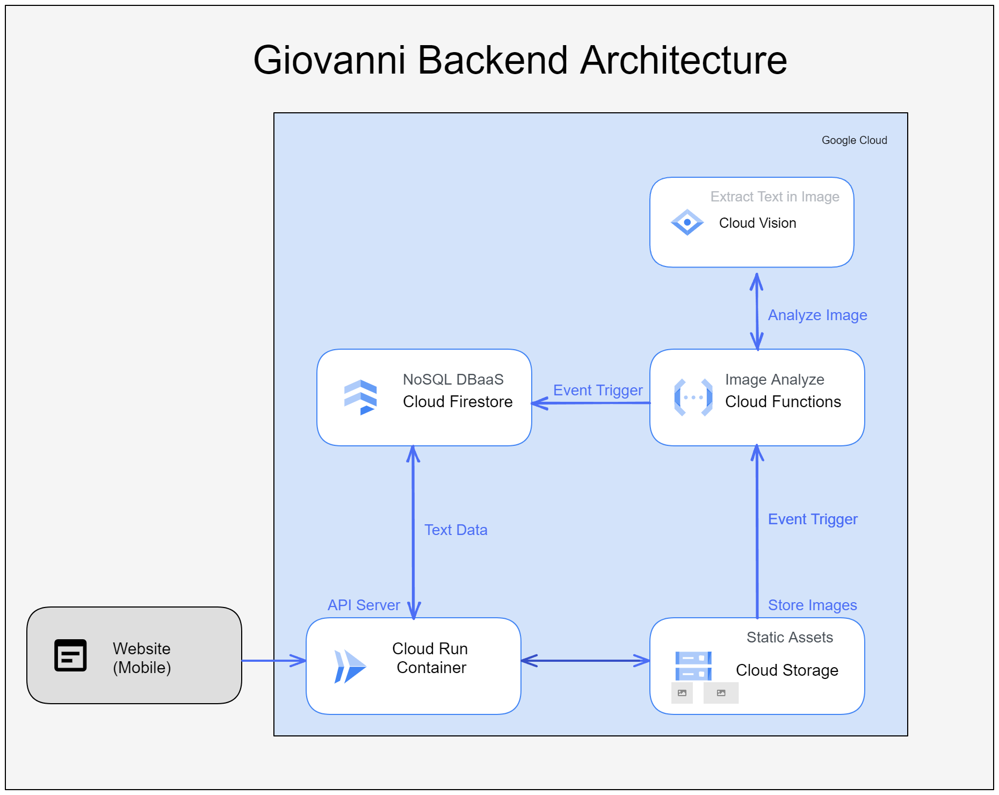
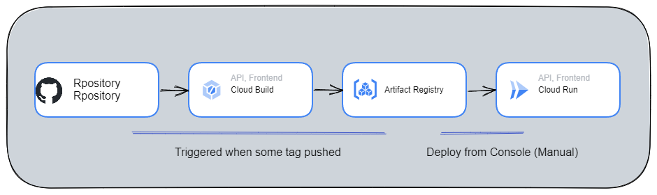

# Giovanni
Giovanni is an application that manages **images and text** (extracted from OCR) It is organized as a collection of individual Sets.
Each user can upload their images and centrally manage both the images and the extracted text.

They also have the option to manually edit the text, regardless of whether it was extracted through OCR or not.
Furthermore, it is possible to group and handle each Set collectively.

This feature proves **useful** when dealing with a large volume of OCR images or when managing images along with descriptive text.

# Data Flow Architecture


- Giovanni backend API run in [Cloud Run](https://cloud.google.com/run)
- OCR part use Google Cloud [Vision API](https://cloud.google.com/vision) with [Cloud - Function](https://cloud.google.com/functions)
- Analyzed Data store in [FireStore](https://firebase.google.com/docs/firestore?hl=en)

# Deploy Flow

- Triggered tag push
- Docker image builded by [Cloud Build](https://cloud.google.com/build) and pushed for [Artifact Registry](https://cloud.google.com/artifact-registry)
- Deploy from Artifact Registry to Cloud Run

# Resource
- app: API for web
    - Python
    - FastAPI
- cloudfunction: analyze image to text with VisionAPI
    - Golang

# Local dev environment
need: pipenv, google cloud platform key which has authorigy for Cloud Storage, And FireStore

```
export GOOGLE_APPLICATION_CREDENTIAL={path for credential}
cd app
pipenv shell
uvicorn main:app --reload
```
