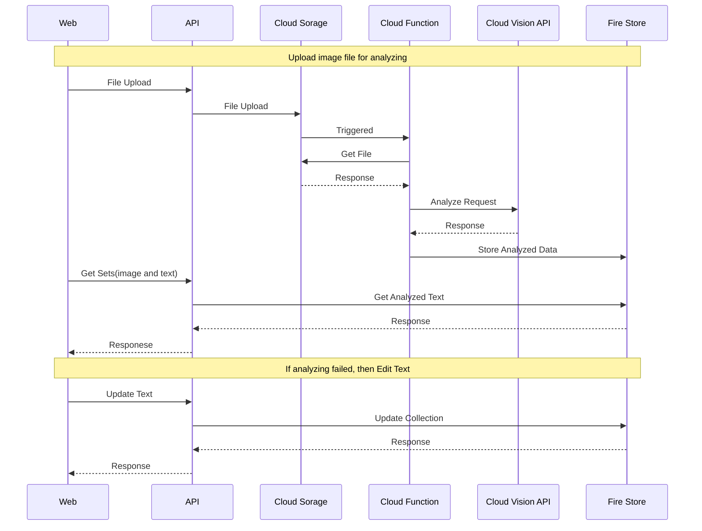

Analyze Flow

```mermaid
sequenceDiagram
    participant W as Web
    participant A as API
    participant CS as Cloud Sorage
    participant CF as Cloud Function
    participant CV as Cloud Vision API
    participant FS as Fire Store

    Note over W, FS: Upload image file for analyzing
    W ->> A: File Upload
    A ->> CS: File Upload
    CS ->> CF: Triggered
    CF ->> CS: Get File
    CS -->> CF: Response
    CF ->> CV: Analyze Request
    CV -->> CF: Response
    CF ->> FS: Store Analyzed Data
    W ->> A: Get Sets(image and text)
    A ->> FS: Get Analyzed Text
    FS -->> A: Response
    A -->> W: Responese
    Note over W, FS: If analyzing failed, then Edit Text
    W ->> A: Update Text
    A ->> FS: Update Collection
    FS -->> A: Response
    A -->> W: Response
```

    A->>+John: Hello John, how are you?
    John->>-A: I feel great!